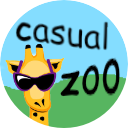
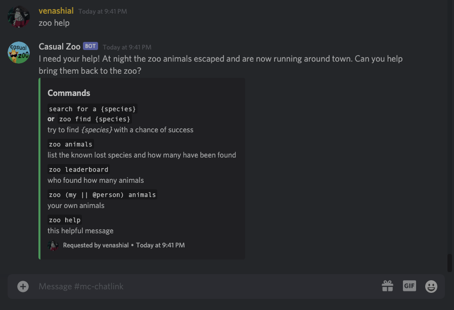
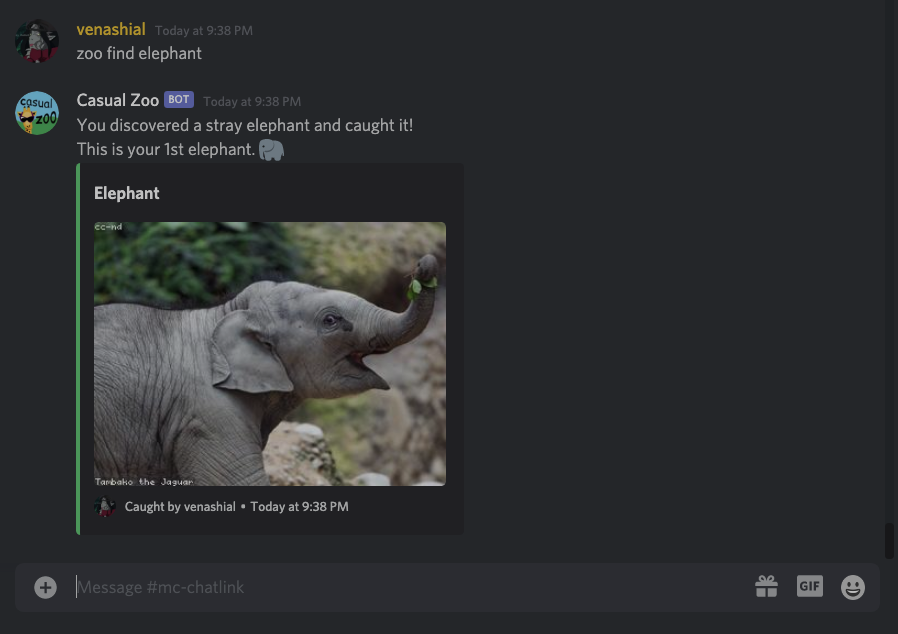
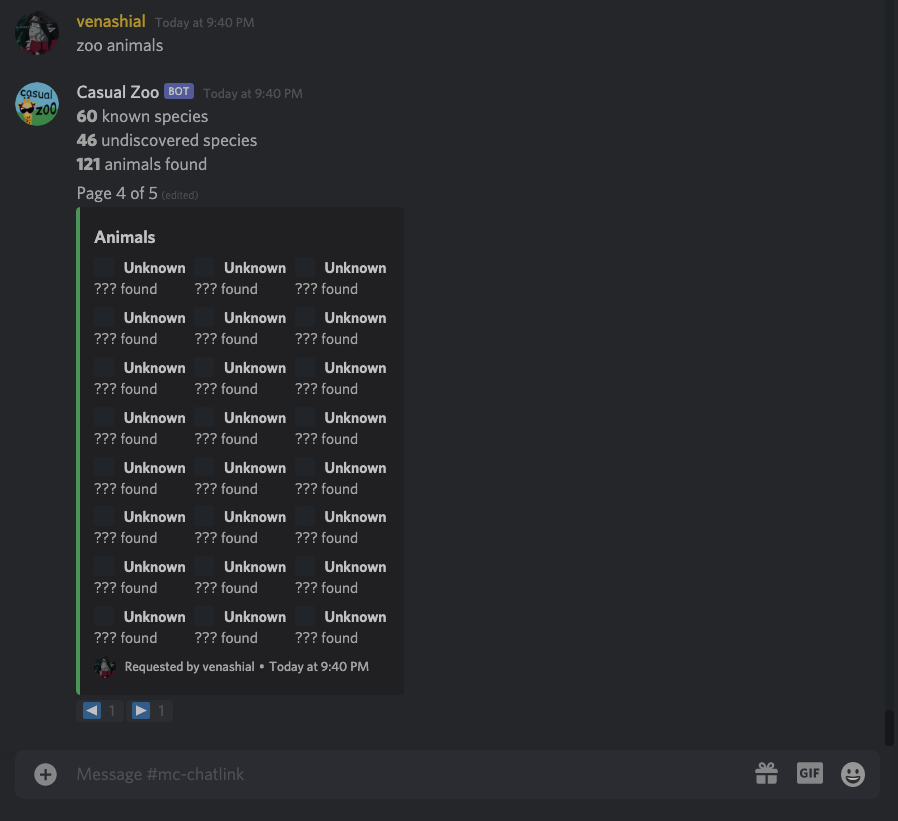

<p align="center">
  
</p>
<h1 align="center">Casual Zoo</h1>

A Discord bot to explore 100+ species of animals with randomized pictures in a competitive style game

## Images






## How to self host
1. Clone Repo

2. Install Modules
```coffee
npm install
```

3. Rename `.env.example` to `.env` and add your own bot's token
```java
TOKEN=YOUR TOKEN HERE
```

1. Add animals to the `animal` table in the `db.sqlite` programmatically using the commented out code in `database.js` or with the sqlite-cli:
```sql
sqlite> INSERT INTO animal (name, url, emoji, found) VALUES ('monkey','monkey,animal','monkey',0)
```

## Disclaimer
Images are requested from [loremflickr.com](https://loremflickr.com/) and queries are occasionally misinterpreted resulting in unrelated results. You can mitigate this by created specific `animal.url`'s such as `owl,bird` instead of just `owl`.